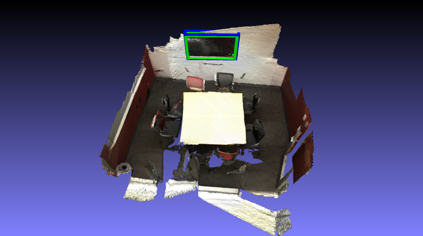
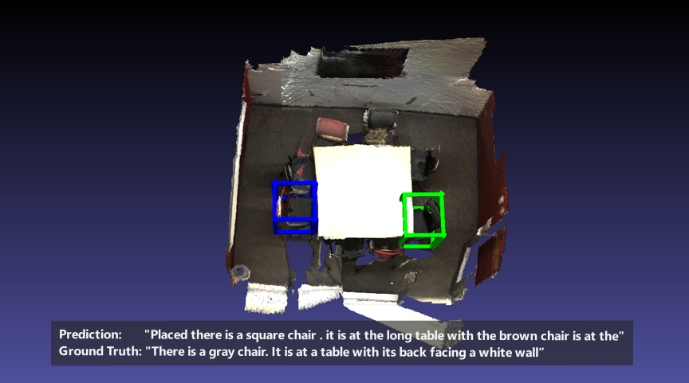

# Joint Architecture for Visual Grounding and Dense Captioning
This repository is implementing a transformer that learns a joint representation of 3D objects and text descriptions in order to solve the tasks of **visual grounding (VG)** and **dense captioning (DC)**. It was implemented by my team partner Zhihao Liang and myself.

The tasks of VG and DC can be described as follows:
- **3D Visual Grounding**: The model predicts the bounding box of an object in a 3D environment. The input consists of a point cloud and a description that matches the target object.
- **3D Dense Captioning**: The model predicts bounding boxes and descriptions for all objects in the 3D environment. The input is a point cloud.

The base for this project was the [Minsu3d](https://github.com/3dlg-hcvc/minsu3d) repository and their framework for running [SoftGroup](https://github.com/thangvubk/SoftGroup).  

## Features
- Transformer-based predictions for 3D dense captioning and 3D visual grounding
- Highly-modularized design enables researchers to easily add different models and datasets.
- Better logging with [W&B](https://github.com/wandb/wandb), periodic evaluation during training.
- Easy experiment configuration and management with [Hydra](https://github.com/facebookresearch/hydra).
- Unified and optimized C++ and CUDA extensions.

## Setup

### Conda (recommended)
We recommend the use of [miniconda](https://docs.conda.io/en/latest/miniconda.html) to manage system dependencies.

```shell
# create and activate the conda environment
conda create -n minsu3d python=3.10
conda activate minsu3d

# install PyTorch 2.0
conda install pytorch pytorch-cuda=11.7 -c pytorch -c nvidia

# install Python libraries
pip install .

# install OpenBLAS
conda install openblas-devel --no-deps -c anaconda

# install MinkowskiEngine
pip install -U git+https://github.com/NVIDIA/MinkowskiEngine -v --no-deps \
--install-option="--blas_include_dirs=${CONDA_PREFIX}/include" --install-option="--blas=openblas"

# install C++ extensions
export CPATH=$CONDA_PREFIX/include:$CPATH
export LD_LIBRARY_PATH=$CONDA_PREFIX/lib:$LD_LIBRARY_PATH
cd minsu3d/common_ops
python setup.py develop
```

### Pip (without conda)
Note: Setting up with pip (no conda) requires [OpenBLAS](https://github.com/xianyi/OpenBLAS) to be pre-installed in your system.

```shell
# create and activate the virtual environment
virtualenv --no-download env
source env/bin/activate

# install PyTorch 2.0
pip3 install torch

# install Python libraries
pip install .

# install OpenBLAS and SparseHash via APT
sudo apt install libopenblas-dev

# install MinkowskiEngine
pip install MinkowskiEngine

# install C++ extensions
cd minsu3d/common_ops
python setup.py develop
```

## Data Preparation

### ScanNet v2 dataset
1. Download the [ScanNet v2](http://www.scan-net.org/) dataset and put it under `minsu3d/data/scannetv2`. To acquire the access to the dataset, please refer to their [instructions](https://github.com/ScanNet/ScanNet#scannet-data). You will get a `download-scannet.py` script after your request is approved:
```shell
# about 10.7GB in total
python download-scannet.py -o data/scannet --type _vh_clean_2.ply
python download-scannet.py -o data/scannet --type _vh_clean.aggregation.json
python download-scannet.py -o data/scannet --type _vh_clean_2.0.010000.segs.json
```

The raw dataset files should be organized as follows:

```shell
minsu3d
├── data
│   ├── scannetv2
│   │   ├── scans
│   │   │   ├── [scene_id]
│   │   │   │   ├── [scene_id]_vh_clean_2.ply
│   │   │   │   ├── [scene_id]_vh_clean_2.0.010000.segs.json
│   │   │   │   ├── [scene_id].aggregation.json
│   │   │   │   ├── [scene_id].txt
```


2. Download the [ScanRefer](https://daveredrum.github.io/ScanRefer/) dataset and put it under `minsu3d/data/scanrefer`.

3. Preprocess the data, it converts original meshes and annotations to `.pth` data:
```shell
python data/scannetv2/preprocess_all_data.py data=scannetv2
```

### SoftGroup
1. Download the pretrained [SoftGroup weights](https://aspis.cmpt.sfu.ca/projects/minsu3d/pretrained_models/SoftGroup_best.ckpt) and put them inside the root folder.

2. Precompute the SoftGroup and BERT output:
```shell
python joint_preprocess.py model=joint_preprocess data=scannetv2
```

## Training, Inference and Evaluation
Note: Configuration files are managed by [Hydra](https://hydra.cc/), you can easily add or override any configuration attributes by passing them as arguments.
```shell
# log in to WandB
wandb login

# train the model from scratch
python train_light.py model=joint_light data=joint

# train a model from a checkpoint
python train_light.py model=joint_light data=joint model.ckpt_path={checkpoint_path}

# test inference results
python test_light.py model=joint_light data=joint model.ckpt_path={checkpoint_path}
```


## Visualization
We provide scripts to visualize the predicted and ground truth bounding boxes. To use the visualization scripts, place the mesh (ply) file from the Scannet dataset as follows.

```
minsu3d
├── data
│   ├── scannetv2
│   │   ├── scans
│   │   │   ├── [scene_id]
|   |   |   |   ├── [scene_id]_vh_clean_2.ply
```

To visualize the predictions run the following commands:

```shell
python test_light.py model=joint_light data=joint model.ckpt_path={checkpoint_path}
cd visualize/scannet
./run.sh 
```

| VG Prediction | DC Prediction |
|:-----------------------------------:|:-----------------------------------:|
|  |  |
| Query: "This is a black tv. It is mounted on a white wall" | Prediction: 	"Placed there is a square chair . it is at the long table with the brown chair is at the" |
||Ground Truth: "There is a gray chair. It is at a table with its back facing a white wall” |


## Acknowledgement
This repo is built upon the [MinkowskiEngine](https://github.com/NVIDIA/MinkowskiEngine) and [SoftGroup](https://github.com/thangvubk/SoftGroup).  We train our models on [ScanNet](https://github.com/ScanNet/ScanNet). If you use this repo and the pretrained models, please cite the original papers.
